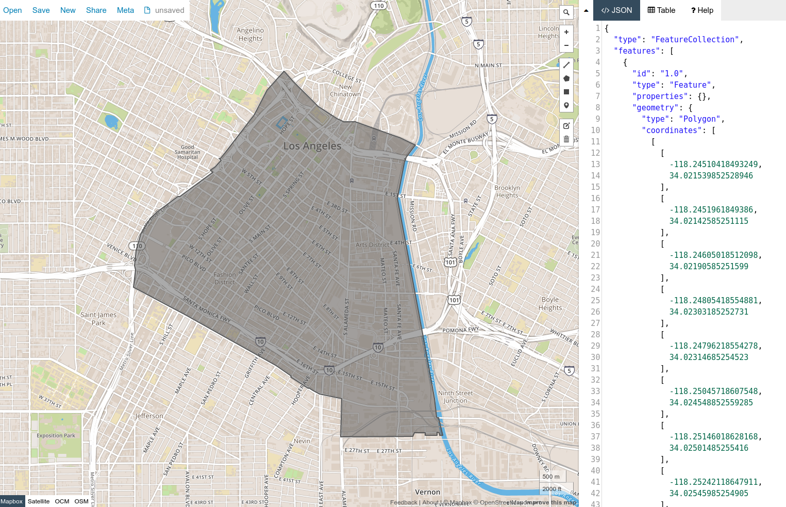

```{include} _templates/nav.html
```

# census-map-consolidator

Combine Census blocks into new shapes.

```{contents} Table of contents
:local:
:depth: 2
```

### Installation

```bash
pipenv install census-map-consolidator
```

### Usage

Create a list of Census block GEOIDs. That can be simple like this:

```python
your_block_list = ["060371976001008", "060371976001009"]
```

Or read in from a file like this:

```python
with open("test_data/dtla.csv", "r") as f:
    your_block_list = f.read().splitlines()
```

Import our class.

```python
from census_map_consolidator import BlockConsolidator
```

Pass in the block list as arguments.

```python
c = BlockConsolidator(*your_block_list)
```

Consolidate the blocks into a single shape. This can take a minute. Big shapefiles have to be downloaded.

```python
c.consolidate()
```

Write out the new shape. You can do GeoJSON.

```python
c.write("./your-new-shape.geojson")
```

Or shapefiles.

```python
c.write("./your-new-shape.shp")
```

That's it. You can inspect your work however you like. But [geojsonio](https://github.com/mapbox/geojsonio-cli) is handy.

```bash
geojsonio < your-new-shape.geojson
```



## Links

* Docs: [palewi.re/docs/census-map-consolidator/](https://palewi.re/docs/census-map-consolidator/)
* Issues: [github.com/datadesk/census-map-consolidator/issues](https://github.com/datadesk/census-map-consolidator/issues)
* Packaging: [pypi.python.org/pypi/census-map-consolidator](https://pypi.python.org/pypi/census-map-consolidator)
* Testing: [github.com/datadesk/census-map-consolidator/actions](https://github.com/datadesk/census-map-consolidator/actions)
